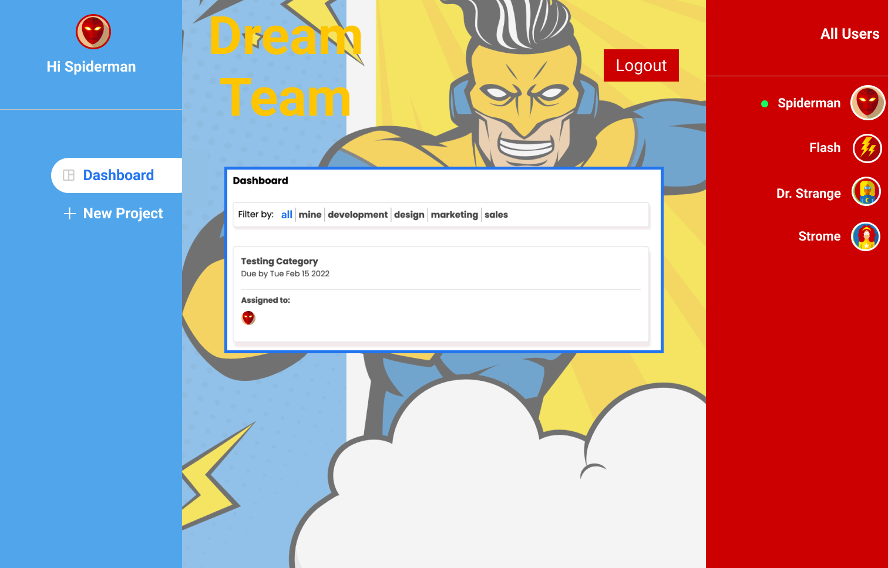

# Dream Team

Dream Team is a user-friendly project management interface. It allows users to know all their project whereabouts at a glance, seamlessly collaborate and communicate with their teammates, and manage the team's entire workload all in one place!

## Features

* Login is for users who already have existing account
* Authentication for all logins
* User can sign up if they haven’t create an account and upload an image of 100kb max size
* User can see which teammate is online and filter projects by category, all teammates, or just their own
* User can create, delete, assign, and communicate project to self or teammates
* Within each project user can directly communicate to teammates via comment feature
* Communication log has timestamp when it was written
* Project assignment includes: title, description, deadline, category, and assignee selections
* When assigned project is complete, user can delete the individual project assignment

## Demo - Superhero Theme
.
.
.
.


## Environment Setup

### Node.js
Node.js is an open-source, cross-platform, back-end JavaScript runtime environment that runs on the V8 engine and executes JavaScript code outside a web browser. Node.js can be downloaded at [Node.js](https://nodejs.org/en/download/) for MacOS or Window. 

### Create React App
After Node.js is installed, to create a React App, run the following command in the terminal: 
```
$ npx create-react-app replace_with_app_name
```

### Firebase
Firebase is a platform developed by Google for creating mobile and web applications. 
* To learn more about [Firebase](https://firebase.google.com/docs), [Security Rules](https://firebase.google.com/docs/web/setup?authuser=0&hl=en), and [Data validation](https://firebase.google.com/docs/rules/data-validation) with Firebase
* To add Firebase to your JavaScript project [Firebase Configuration](https://firebase.google.com/docs/web/setup?authuser=0&hl=en) 

For this project we will be using Firebase version 8.5, run the following command in the terminal: 
```
$ npm install firebase@8.5
```
To initialize Firebase, run the following command in the terminal:
```
$ firebase init
```
After running the __firebase init__ command answers the following prompts on terminal:
1. Are you ready to proceed? (y/n) __y__
2. Choose the appropriate Firebase features for your project. For this project select the following features with the space bar: 
* -[x] Firestore: Configure security rules and indexes files for Firestore
* -[x] Hosting: Configure files for Firebase Hosting and (optionally) set up GitHub Action deploys
* -[x] Storage: Configure a security rules file for Cloud Storage

3. Select “__Use an existing project__” assuming you already set up and registered your app project on Firestore ahead of time. If you haven’t then select “__Create a new project__” and follow the instructions on terminal. 
4. What file should be used for Firestore Rules? __firestore.rules__ (keep as default by pressing enter).
5. What file should be used for Firestore Indexes? __firestore.indexes.json__ (keep as default by pressing enter).
6. What do you want to use as your public directory? __built__  (change default to _build_ and press enter. This will be the folder we’ll deploy) 
7. Configure as a single-page app (rewrite all urls to /index.html)? (y/n)  __y__ (React App is a single-page)
8. Set up automatic builds and deploys with GitHub? (y/n)  __n__
9. What file should be used for Storage Rules? __storage.rules__ (keep as default by pressing enter).

__Now Firebase initialization is complete!!__

### Dependencies: React-Router-Dom and React-Select
To download dependencies defined in the package.json file and generates a node_modules folder with the installed modules, run the following command in the terminal: 
```
$ npm install
```

[React-Router-Dom](https://reactrouter.com/) is an npm package that enables you to implement dynamic routing in a web app.

To install react-router-dom (we use version 6 for this project), run the following command in the terminal: 
```
$ npm install react-router-dom@6
```

[React-Select](https://react-select.com/home) is a flexible and beautiful _Select Input_ control for ReactJS with multiselect, autocomplete, async and creatable support.

To install react-select, run the following command in the terminal: 
```
$ npm install react-select
```

## Available Scripts

In the project directory, you can run:

#### `npm run start`

Runs the app in the development mode.\
Open [http://localhost:3000](http://localhost:3000) to view it in the browser.

The page will reload if you make edits.\
You will also see any lint errors in the console.

#### `npm test`

Launches the test runner in the interactive watch mode.\
See the section about [running tests](https://facebook.github.io/create-react-app/docs/running-tests) for more information.


## Deployment
We’re going to deploy this project on Firebase. 

To do so, run the following command in the terminal: 
```
$ npm run build
```

To deploy on Firebase, run the following command in the terminal:
```
$ firebase deploy
```
#### Congratulations you’ve completed the project!!!
